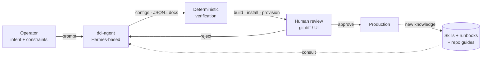
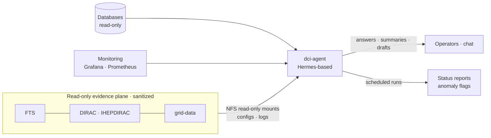
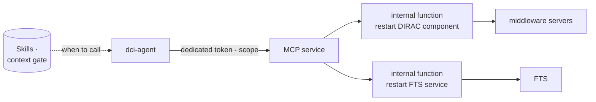
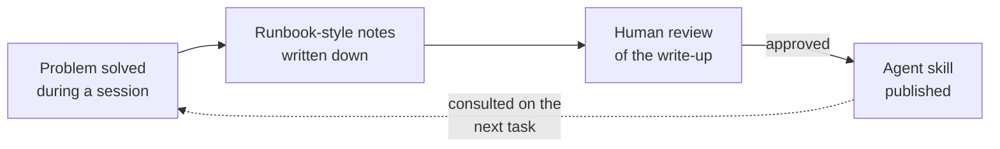

# AI-Assisted DIRAC Deployment and Operations at IHEP

#### dci-agent, scoped actions, and knowledge that accumulates

 

**Xiao Han** on behalf of the IHEP DCI Group · <a href="mailto:hanx@ihep.ac.cn">hanx@ihep.ac.cn</a>

 

**The 12th DIRAC(X) Users' Workshop** · 2026 · *IHEP, Beijing*

<a href="https://dci-grafana.ihep.ac.cn/" class="ns-c-iconlink"><mdi-view-dashboard-outline /> DCI Grafana</a>
 · <a href="https://github.com/hanx-hep/2026-cepc-dci" class="ns-c-iconlink"><mdi-history /> Monitoring report</a>

<!--
Timing: 0:30

Good morning. I am Xiao Han, from the IHEP DCI Group. This talk is about AI-assisted deployment and operations of DIRAC at IHEP. The core is an agent we call dci-agent: it sees the whole middleware chain through a read-only, sanitized evidence plane, answers operators in chat, runs scheduled analyses — and can execute a small set of whitelisted actions through scoped MCP services. Deployment work toward DIRAC v9 comes as a case study of the same principles.
-->
---
layout: default
---

# What operating the IHEP DCI involves

  

  
<small>PRODUCTION</small><strong>DIRAC v8.0.58 for JUNO</strong>60+ components on 5 servers; 6 SiteDirector instances (JUNO, CEPC, CMS, BES, LHCb, JUNOCloud).

  
<small>MIDDLEWARE CHAIN</small><strong>FTS · grid-data · IHEPDIRAC</strong>Transfers, storage and site services — each with its own configs and logs.

  
<small>IN PREPARATION</small><strong>v9.0.22 migration baseline</strong>An isolated test host with a clean v9 install, validated step by step.

  

  

The daily work is four streams:

- **Deploy** — version upgrades, component installs, config changes
- **Watch** — metrics, availability probes, dashboards
- **Diagnose** — component logs, transfer chains, cross-system traces
- **Record** — runbooks, install notes, the knowledge the next shift needs

A fault's symptom and its cause often live on <strong>different systems</strong> — exactly where an agent with one read-only view helps.

  

<!--
Timing: 0:50

Context first. In production we run DIRAC v8.0.58 for JUNO: more than sixty components on five servers, six SiteDirectors. Around it runs a middleware chain — FTS for transfers, grid-data and site services — each with its own configurations and logs. A v9 migration baseline is being prepared in isolation. The daily work is four streams: deploy, watch, diagnose, record. The pain point: a symptom shows on one system, the cause hides on another. That is exactly where an agent with one read-only view across the chain helps.
-->
---
layout: default
---

# Layered autonomy — humans keep the gates

  

    <h2>L1 · Observes</h2>
    
Read-only evidence plane: dashboards, logs, configs, databases — all sanitized.

  

  

    <h2>L2 · Advises</h2>
    
Agent aggregates, analyzes status, drafts diagnoses — always for human review.

  

  

    <h2>L3 · Scoped actions</h2>
    
Whitelisted operations via MCP with scoped tokens — restart a component, restart FTS.

  

  

    <h2>L4 · Bounded acts</h2>
    
Wider envelope with caps and rollback. Not claimed today — to be earned by data.

  

The axis is <strong>control, not capability</strong>. Reading is free; acting is a whitelist. A weak model produces a poor answer — never an unplanned production change.

<!--
Timing: 1:20

The principle, borrowed from autonomy levels, with control — not capability — as the axis. Level one: the system observes, through a read-only, sanitized view of everything. Level two: the AI advises — aggregation, status analysis, diagnosis drafts, for human review. Level three: scoped actions — a small whitelist of operations executed through MCP services with dedicated scoped tokens, like restarting a DIRAC component or an FTS service. Level four — a wider envelope with caps and rollback — we do not claim today. The rule that makes this safe: reading is free, acting is a whitelist. A weak model produces a poor answer, never an unplanned production change.
-->
---
layout: default
---

# The loop: intent → agent → verify → review

  
<strong>Agent side</strong> Repetitive work: config surgery, dashboard JSON, install debugging, multi-source analysis.

  
<strong>Human side</strong> Intent and constraints, the final review of every diff, and the decision to act on production.

<!--
Timing: 1:00

Here is the loop we run for anything that changes the system. The operator states intent; the agent — Hermes-based, carrying our accumulated skills and runbooks — produces configurations, dashboard JSON, or documentation; verification is deterministic — it installs, builds, provisions, or fails, never decided by the LLM; a human reviews the diff and approves. What we learn flows back into the skill library. Next: how the same agent operates day to day.
-->
---
layout: section
---

# 1 · Deploy: the v8 → v9 upgrade prep

<!--
Timing: 0:10

Part one: deployment — the DIRAC v8 to v9 upgrade preparation, done with an agent in the loop.
-->
---
layout: default
---

# A v9.0.22 baseline, built with an agent

  

## What the agent did

- Clean **v9.0.22** install on isolated `diractest` — fresh databases, DIRACOS2 via proxy
- Debugged the pitfalls: proxy hijack, OpenSearch section names, descriptor and MySQL limits, certificate FQDN mismatch
- Stood up **SiteDirectorJUNO**, validated the pilot chain to an HTCondor CE
- Documented every session as runbook-style notes

Production stays on <strong>v8.0.58</strong> until readiness is proven.

  

  

## What humans kept

- Version choice and go / no-go — production untouched
- Secrets discipline: tokens and keys <strong>never</strong> enter prompts or docs

  
<mdi-check-circle-outline /><strong>Pilot chain validated</strong> SiteDirectorJUNO → HTCondor CE → queue → payload

  
<mdi-check-circle-outline /><strong>Reusable notes</strong> Each pitfall is a documented step, not tribal memory

  

<!--
Timing: 1:15

The upgrade case, briefly. On an isolated host the agent did a clean v9.0.22 install — fresh databases, DIRACOS2 through a proxy — and debugged the real pitfalls: a proxy hijacking the setup script, OpenSearch section names that differ between install and runtime, file-descriptor and MySQL limits, and a certificate hostname mismatch. It stood up SiteDirectorJUNO and validated the pilot chain to an HTCondor CE. Humans kept the version decision, the go/no-go, and the secrets discipline. Production stays on v8.0.58. Every pitfall is now a documented step. This is the deployment face of the same loop — now the main part: operations.
-->
---
layout: section
---

# 2 · Operate: dci-agent and scoped MCP

<!--
Timing: 0:10

Part two — the main part: dci-agent, how it sees the chain, and how it acts.
-->
---
layout: default
---

# dci-agent: one read-only view of the chain

  
<strong>How it sees</strong> NFS mounts configs and logs <em>read-only</em>; databases and monitoring connect read-only; content is sanitized before any prompt.

  
<strong>What it does</strong> Aggregates across sources, analyzes running state, assists troubleshooting — on demand or on schedule.

<!--
Timing: 1:25

The core of the talk. dci-agent is built on Hermes, and its superpower is boring: it has one read-only view of the whole chain. The config and log folders of FTS, DIRAC, IHEPDIRAC, and grid-data are NFS-mounted read-only. Databases and monitoring are connected with read-only access. Everything the agent reads is sanitized before it reaches a prompt. With that one view, it aggregates information across sources, analyzes the running state, and assists troubleshooting when something looks wrong. And it works in two modes — which is the next slide.
-->
---
layout: default
---

# Driven by chat, and by the clock

  

## Interactive — operators ask

  
<small>ASK</small><strong>"What is the transfer status for site X?"</strong>The agent pulls FTS logs, DIRAC data-operation views, and answers with sources.

  
<small>ASSIST</small><strong>"Help me triage this failure"</strong>It correlates logs and configs across systems and drafts a first-pass diagnosis for review.

  

  

## Scheduled — it runs itself

  
<small>PERIODIC</small><strong>Multi-source aggregation</strong>Scheduled tasks collect status across the chain and summarize the running state.

  
<small>ON ANOMALY</small><strong>Analysis for review</strong>When something looks off, the analysis is drafted and flagged — the operator judges.

  

Same evidence plane, same sanitized read-only rule — only the <strong>trigger</strong> differs: a message from a person, or the clock.

<!--
Timing: 1:05

dci-agent is driven two ways. Interactively: operators talk to it in chat — ask for the transfer status of a site, ask for help triaging a failure — and it answers with evidence it can cite, or drafts a first-pass diagnosis for review. And on a schedule: periodic tasks aggregate status across the chain and summarize the running state; when something looks off, an analysis is drafted and flagged for a human to judge. The same evidence plane and the same read-only rule apply in both modes — only the trigger differs: a message from a person, or the clock.
-->
---
layout: default
---

# Read-only and sanitized by construction

  

## Read-only is a property, not a policy

- NFS mounts are <strong>read-only</strong> — configs and logs cannot be written
- Database and monitoring connections are <strong>read-only accounts</strong>
- The evidence plane simply has <strong>no write path</strong> to the middleware

Worst case is a wrong answer — never a corrupted system.

  

  

## Sanitized before the model

- Log and config content is <strong>masked</strong> — credentials, tokens, keys filtered out
- Sized and classified before entering any prompt
- Humans always see the <strong>raw</strong> data in the UI; only the model reads the filtered copy

A crafted log line cannot steer the agent — injection-safe by construction.

  

<!--
Timing: 1:00

Two design decisions carry most of the safety. First: read-only is a property, not a policy. The NFS mounts are read-only, the database and monitoring accounts are read-only — the evidence plane has no write path to the middleware at all. The worst the agent can do is be wrong, not destructive. Second: everything is sanitized before the model sees it. Credentials, tokens and keys are filtered; content is sized and classified. A crafted log line cannot steer the agent. Humans, of course, always see the raw data — only the model reads the filtered copy. So how does the agent ever act? Through a very narrow door.
-->
---
layout: default
---

# Actions live inside MCP functions

  
<mdi-key-outline /><strong>Scoped tokens</strong> — the agent authenticates with a dedicated token whose scope names exactly what may be executed; nothing else is reachable.

  
<mdi-cube-outline /><strong>Operations are code, not prompts</strong> — "restart component X" is an internal function inside the MCP service; the agent cannot compose arbitrary shell commands.

  
<mdi-book-open-variant-outline /><strong>Skills gate the context</strong> — the agent's skills define when calling an action MCP is appropriate at all; outside those scenarios it does not offer the action.

<!--
Timing: 1:25

The narrow door. To let the agent act, we added MCP services. The agent authenticates with a dedicated token, and the token's scope names exactly which operations are reachable — nothing else. The operations themselves are internal functions inside the MCP service: restart a DIRAC component, restart an FTS service. The agent cannot compose arbitrary shell commands — it can only invoke the whitelisted function. And on top of that, the agent's skills define the context in which calling the action is appropriate at all: outside those scenarios, the action is not offered. So the blast radius of any mistake — the model's or ours — is bounded by three independent gates: the scope, the function boundary, and the skill context. That is level-three autonomy as we practice it.
-->
---
layout: default
---

# The evidence layer in one place

  

## Monitoring behind the agent too

- **31 dashboards as Git JSON** — five provisioning providers, 30 s sync; the agent can compose them, humans review the diff
- **Central DIRAC logs** — one backend line sends 60+ components through ActiveMQ → Logstash → Elasticsearch
- The agent reads the <strong>same evidence</strong> operators see — no private data path

Dashboards, metrics, logs: one evidence layer serving people and agents alike.

  

  

  <iframe
    src="https://dci-grafana.ihep.ac.cn/d/bfgu666p30xdsb/component-logs?orgId=1&from=1788912000000&to=1788998400000&timezone=browser&var-Category=$__all&var-Name=$__all&var-Level=$__all&kiosk"
    scrolling="yes"
    class="component-dashboard-iframe"
  ></iframe>

  <a href="https://dci-grafana.ihep.ac.cn/d/bfgu666p30xdsb/component-logs?orgId=1&from=1788912000000&to=1788998400000&timezone=browser&var-Category=$__all&var-Name=$__all&var-Level=$__all&kiosk"><mdi-open-in-new /> Open full dashboard</a>

  

<!--
Timing: 1:00

The evidence layer underneath all of this. The Grafana dashboards are JSON in Git — thirty-one of them under five providers — so the agent can compose them and humans review the diff; that is one small, useful piece of automation. The DIRAC component logs are centralized with one backend line through ActiveMQ, Logstash and Elasticsearch. The live view on the right is what both operators and the agent read — the same evidence, no private data path for the model. Reading is free; that was the design choice.
-->
---
layout: section
---

# 3 · Make the knowledge stick

<!--
Timing: 0:10

Part three: the part that compounds — turning fixes into reusable knowledge.
-->
---
layout: default
---

# Every fix becomes a skill

  
<strong>In place today</strong> DIRAC and job-operations skills on shared storage; per-repository agent guides; upgrade notes from the v9 sessions.

  
<strong>Skills do double duty</strong> They make the agent smarter about the chain — and they define when an action MCP may be called at all.

The v9 install pitfalls were solved once and <strong>documented once</strong> — the next host will not rediscover them. Every fix makes the next one easier.

<!--
Timing: 1:00

This is the loop that makes the work compound. A problem gets solved during a session; the write-up happens in runbook style; a human reviews it; approved notes become agent skills on shared storage or repository guides. Two effects: the next session starts from the accumulated steps, and the skills double as context gates for the action MCPs — they define when an action may be offered at all. The upgrade is the proof: each pitfall was solved once and documented once. Every fix makes the next one easier.
-->
---
layout: default
---

# Five rules that keep it safe

  
<mdi-check-circle-outline /><strong>The evidence plane is read-only by construction.</strong> NFS mounts, database and monitoring accounts — there is no write path from the agent to the middleware.

  
<mdi-check-circle-outline /><strong>Everything the model reads is sanitized.</strong> Credentials, tokens and keys are filtered before any prompt; humans keep the raw view.

  
<mdi-check-circle-outline /><strong>Actions are whitelisted functions behind scoped tokens.</strong> The agent invokes predefined operations — it cannot compose arbitrary commands.

  
<mdi-check-circle-outline /><strong>Skills gate when actions may be invoked.</strong> Outside the defined scenarios, the action is not offered to the model at all.

  
<mdi-check-circle-outline /><strong>Knowledge is written to be consulted.</strong> Notes and skills are part of the workflow, not an afterthought — they are what the next session reads first.

<!--
Timing: 1:05

Five rules hold the system together. The evidence plane is read-only by construction — no write path exists. Everything the model reads is sanitized — secrets are filtered, humans keep the raw view. Actions are whitelisted functions behind scoped tokens — the agent invokes, it cannot compose. Skills gate when actions may be invoked at all. And knowledge is written to be consulted — notes are part of the workflow. None of this required a new platform: disciplines, applied to ordinary mounts, tokens, functions and documents.
-->
---
layout: default
---

# Roadmap: earn autonomy with evidence

  

## Horizontal — widen the view

  
<mdi-arrow-right-circle-outline /><strong>More sources, same contract</strong> More middleware log and config mounts; scheduled analyses over all of them

  
<mdi-arrow-right-circle-outline /><strong>Log early warning</strong> Error patterns and log-rate anomalies from the centralized logs

  
<mdi-arrow-right-circle-outline /><strong>RAG over runbooks</strong> Natural-language query over accumulated notes, on our own infra

  

  

## Vertical — widen the whitelist

  
<mdi-arrow-right-circle-outline /><strong>More MCP functions</strong> Each new operation is added as a reviewed internal function with its own scope

  
<mdi-arrow-right-circle-outline /><strong>Audit table first</strong> Every proposal, decision and outcome persisted before any envelope widens

  
<mdi-arrow-right-circle-outline /><strong>L4: caps and rollback</strong> Reversible actions only, rate-limited, auto-rollback — earned by data

  

Each new action is a deliberate <strong>code review</strong>, not a prompt tweak. Autonomy is earned by evidence, not by confidence.

<!--
Timing: 1:00

The roadmap. Horizontal: widen the view — more middleware mounts under the same read-only contract, log early warning from the centralized logs, and retrieval over our own runbooks on our own infrastructure. Vertical: widen the whitelist — but each new operation enters as a reviewed internal function with its own scope; an audit table comes before any envelope widens; and level four, eventually, means reversible actions with rate limits and automatic rollback. Each new action is a deliberate code review, not a prompt tweak. Autonomy is earned by evidence, not by confidence.
-->
---
layout: default
---

# Summary

  
<strong>1</strong><h2>Read-only</h2>
One sanitized, read-only view of the whole middleware chain — chat-driven or scheduled, worst case is a wrong answer.

  
<strong>2</strong><h2>Scoped actions</h2>
Acting means invoking a whitelisted MCP function with a scoped token, in a skill-defined context — nothing more.

  
<strong>3</strong><h2>Compounding</h2>
Every fix becomes a note, a skill, a guide. The next session — and the next experiment — starts from all of them.

The goal is not an autopilot. 
It is an <strong>operator with a much longer reach</strong>.

<!--
Timing: 0:50

Three takeaways. Read-only: one sanitized view of the whole chain, driven by chat or by the clock — the worst case is a wrong answer, not a broken system. Scoped actions: acting means invoking a whitelisted function with a scoped token in a skill-defined context, and nothing more. Compounding: every fix becomes a note, a skill, a guide — the next session and the next experiment start from all of them. The goal is not an autopilot. It is an operator with a much longer reach. Thank you.
-->
---
layout: cover
loop: true
title: Questions
---

# Thank you. Questions?

**Xiao Han · IHEP, CC** 
IHEP DCI Group

<a href="https://dci-grafana.ihep.ac.cn/"><mdi-view-dashboard-outline /> dci-grafana.ihep.ac.cn</a>
 · <a href="https://github.com/hanx-hep/2026-cepc-dci"><mdi-github /> monitoring report</a>

<!--
Timing: 0:15

That is the end of my talk. Thank you — I am happy to take questions.
-->
