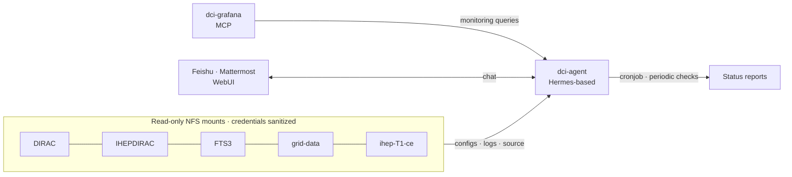
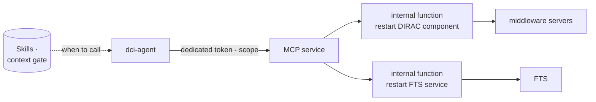
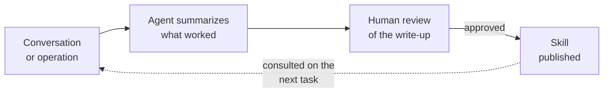

# AI-Assisted DIRAC Deployment and Operations at IHEP

#### dci-agent, staged autonomy, MCP and skills

 

**Xiao Han** on behalf of the IHEP DCI Group · <a href="mailto:hanx@ihep.ac.cn">hanx@ihep.ac.cn</a>

 

**The 12th DIRAC(X) Users' Workshop** · 2026 · *IHEP, Beijing*

<a href="https://dci-grafana.ihep.ac.cn/" class="ns-c-iconlink"><mdi-view-dashboard-outline /> DCI Grafana</a>
 · <a href="https://github.com/hanx-hep/2026-cepc-dci" class="ns-c-iconlink"><mdi-history /> Monitoring report</a>

<!--
Timing: 0:30

Good morning. I am Xiao Han, from the IHEP DCI Group. AI models keep getting stronger — they reason better, and they understand systems like ours better every year. We decided to put that to work: at IHEP we run an operational agent, dci-agent, which helps us deploy and operate DIRAC and the middleware chain around it. This talk has two halves: first the operations story — what dci-agent is and does, including a DIRAC v9 deployment it carried out in the test environment; then the AI infrastructure underneath — the MCP services and the skills that make it useful and safe.
-->
---
layout: default
---

# AI is ready to help operate the DCI

  

## Why now

- Models are <strong>stronger</strong> — better reasoning over configs, logs, and code
- They <strong>understand our stack</strong> — DIRAC, FTS, grid middleware are well-documented territory
- Tool ecosystems matured — <strong>MCP</strong>, agent frameworks, skill libraries

At IHEP's DCI we deployed <strong>dci-agent</strong>: an operational agent that watches the middleware chain, reports, assists troubleshooting — and, step by step, learns to act.

  

  

## What we ask of it

- <strong>See everything</strong> — configs, logs, source code, databases, monitoring
- <strong>Answer and report</strong> — on demand in chat, and on a schedule
- <strong>Help deploy</strong> — it completed a DIRAC v9 test deployment
- <strong>Stay safe</strong> — read-only by construction; actions only through whitelisted MCP functions

Four asks — the rest of this talk presents them in order.

  

<!--
Timing: 0:50

Why this talk, now. Three shifts: the models are genuinely stronger at reasoning over configuration, logs and code; they understand our kind of stack, because DIRAC, FTS and grid middleware are well-documented; and the tooling matured — MCP services, agent frameworks, skill libraries. So we deployed dci-agent in the IHEP DCI. We ask four things of it: see everything, answer and report, help deploy, and stay safe. The rest of the first half explains each of those in turn.
-->
---
layout: default
---

# What operating the IHEP DCI involves

  

  
<small>PRODUCTION</small><strong>DIRAC v8.0.58 for JUNO</strong>60+ components on 5 servers; 6 SiteDirector instances (JUNO, CEPC, CMS, BES, LHCb, JUNOCloud).

  
<small>MIDDLEWARE CHAIN</small><strong>FTS3 · grid-data · IHEPDIRAC · T1 CE</strong>Transfers, storage and site services — each with its own configs, logs, and source.

  
<small>IN PREPARATION</small><strong>v9 migration baseline</strong>A test host where the agent recently completed a v9.0.24 deployment.

  

  

The daily work is four streams:

- **Deploy** — version upgrades, component installs, config changes
- **Watch** — metrics, availability probes, dashboards
- **Diagnose** — component logs, transfer chains, cross-system traces
- **Record** — runbooks, install notes, the knowledge the next shift needs

A fault's symptom and its cause often live on <strong>different systems</strong> — exactly where an agent with one read-only view helps.

  

<!--
Timing: 0:50

Context. In production we run DIRAC v8.0.58 for JUNO — sixty-plus components, six SiteDirectors — inside a middleware chain of FTS3, grid-data, IHEPDIRAC and the T1 computing element. Daily work is four streams: deploy, watch, diagnose, record. And the pain point: symptoms and causes live on different systems. That is the gap dci-agent fills. Before the architecture, one slide on how we think an AI assistant should grow into this job.
-->
---
layout: section
---

# 1 · Operate: the dci-agent

<!--
Timing: 0:10

Part one: dci-agent — how an AI operations assistant should grow, what it is, and what it has already done.
-->
---
layout: default
---

# Four stages, one learning engine

  

    <h2>1 · Analyzes</h2>
    
Completely read-only: advice, alarms, first-pass diagnosis — evidence cited, humans decide.

  

  

    <h2>2 · Assists</h2>
    
Executes harmless operations — the routine, reversible work that burdens administrators.

  

  

    <h2>3 · Acts, approved</h2>
    
Critical operations prepared and executed only with the administrator's consent.

  

  

    <h2>4 · Autopilots</h2>
    
Full automation of routine operations — the direction, not today's claim.

  

The engine of the climb is <strong>learning</strong>: after each conversation and operation, the agent — Hermes-based — summarizes what worked into a <strong>skill</strong>. As model strength and accumulated skills grow, the safe level of automation rises with them.

<!--
Timing: 1:20

How should an AI assistant grow into an operations role? Four stages. Stage one: completely read-only — it analyzes, advises, raises alarms; humans decide everything. Stage two: it executes harmless operations, the routine and reversible work that eats administrator time. Stage three: critical operations, prepared and executed only with the administrator's consent. Stage four: full automation — that is the direction, not today's claim. And what moves a deployment up this ladder is not faith in the model: it is learning. The agent is Hermes-based; after each conversation and each operation it summarizes what worked into a skill. The more it accumulates, and the stronger the models get, the higher the safe level of automation.
-->
---
layout: default
---

# dci-agent: one read-only view of the chain

  
<strong>How it sees</strong> NFS mounts the configs, logs, and source of DIRAC, IHEPDIRAC, FTS3, grid-data and the T1 CE — all read-only, credentials fully sanitized; monitoring arrives through the dci-grafana MCP.

  
<strong>How it is reached</strong> Administrators talk to it through Feishu, Mattermost, or a web UI; a cronjob drives periodic status checks and reports.

<!--
Timing: 1:25

The architecture. dci-agent is Hermes-based, and its foundation is boring on purpose: NFS mounts over the middleware servers, read-only, covering the configurations, the logs, and the source code of DIRAC, IHEPDIRAC, FTS3, grid-data, and the T1 computing element. Every credential in those files is sanitized before the agent sees anything. Monitoring comes in through the dci-grafana MCP service — dashboards and metrics as queryable tools. On the usage side: administrators reach it through Feishu, Mattermost, or a web UI, and a cronjob drives periodic checks that produce status reports. One agent, one view, many doors in.
-->
---
layout: default
---

# Read-only and sanitized by construction

  

## Read-only is a property, not a policy

- NFS mounts are <strong>read-only</strong> — configs, logs, and source cannot be written
- The evidence plane simply has <strong>no write path</strong> to the middleware

Worst case is a wrong answer — never a corrupted system.

  

  

## Sanitized before the model

- <strong>All credentials sanitized</strong> — tokens, keys and passwords masked out of configs and logs
- Content is sized and classified before entering any prompt
- Humans always see the <strong>raw</strong> data; only the model reads the filtered copy

A crafted log line cannot steer the agent — injection-safe by construction.

  

<!--
Timing: 1:00

Two design decisions carry most of the safety. First, read-only is a property, not a policy: the NFS mounts are read-only, so the agent has no write path to the middleware at all. The worst it can do is be wrong, not destructive. Second, sanitization: every credential — tokens, keys, passwords — is masked out of configurations and logs before anything reaches the model. Content is sized and classified. Humans always see the raw data; only the model reads the filtered copy. A crafted log line cannot steer the agent. So how does it ever act? Through a very narrow door — but that is the second half of the talk.
-->
---
layout: default
---

# Driven by chat, and by the clock

  

## Interactive — administrators ask

  
<small>ASK</small><strong>"What is the transfer status for site X?"</strong>It pulls FTS3 logs, DIRAC data-operation views, and answers with sources.

  
<small>ASSIST</small><strong>"Help me triage this failure"</strong>It correlates logs, configs and source across systems, and drafts a diagnosis for review.

  

  

## Scheduled — it runs itself

  
<small>PERIODIC</small><strong>Cronjob status checks</strong>Periodic aggregation across the chain; summaries of the running state.

  
<small>ON ANOMALY</small><strong>Analysis for review</strong>When something looks off, the analysis is drafted and flagged — the administrator judges.

  

Reachable through Feishu, Mattermost and the web UI — the same agent, the same evidence plane; only the <strong>trigger</strong> differs: a message, or the clock.

<!--
Timing: 1:05

Two ways to drive it. Interactively: an administrator asks, in Feishu, Mattermost or the web UI — what is the transfer status for this site, help me triage this failure — and the agent answers with sources it can cite, or drafts a diagnosis for review. And on a schedule: a cronjob triggers periodic status checks that aggregate across the chain and summarize the running state; anomalies get a drafted analysis flagged for a human to judge. Same agent, same read-only evidence plane — only the trigger differs: a message, or the clock.
-->
---
layout: default
---

# The agent deployed v9 in the test bed

  

## What the agent did

- Given <strong>operation permission in the test environment only</strong>
- Installed <strong>DIRAC v9.0.24</strong> and basically completed the deployment
- The speed came from understanding: <strong>config comparison</strong> and <strong>log inspection</strong> across the DCI stack, on demand
- Every step recorded as runbook-style notes

Production stays on <strong>v8.0.58</strong> — untouched.

  

  

## Why it worked

- The agent already <strong>knows the DCI system</strong>: configs, logs, and source are its home turf
- v8-vs-v9 <strong>config comparison</strong> is exactly its kind of cross-file reasoning
- Install pitfalls became <strong>documented steps</strong>, not repeated debugging

  
<mdi-check-circle-outline /><strong>Test deployment completed</strong> v9.0.24 on the isolated test host

  
<mdi-check-circle-outline /><strong>Reusable runbook</strong> Each pitfall is a documented step for the next host

  

<!--
Timing: 1:20

The deployment result. We gave the agent operation permission in the test environment only, and it installed DIRAC v9.0.24 and basically completed the deployment. The point is not that installing DIRAC is magic — it is that the agent already knows the system: its configs, logs, and source are its home turf. Comparing a v8 configuration against v9 defaults, checking why a component will not start by reading its logs — that is exactly the cross-file reasoning agents are good at. The install pitfalls it worked through became documented steps, so the next host will not rediscover them. And production stays on v8.0.58, untouched. Now — the second half: the AI infrastructure that makes any of this safe.
-->
---
layout: section
---

# 2 · AI infrastructure: MCP and skills

<!--
Timing: 0:10

Part two: the infrastructure underneath — MCP services on the read and write sides, and the skills that make the agent useful to administrators and users alike.
-->
---
layout: default
---

# Read side: monitoring through MCP

  

## One queryable evidence layer

- **dci-grafana MCP** — the agent searches dashboards, reads panel queries, runs Prometheus queries, returns rendered panels
- **31 dashboards as Git JSON** — five provisioning providers, 30 s sync; the agent can compose them, humans review the diff
- **Central DIRAC logs** — one backend line sends 60+ components through ActiveMQ → Logstash → Elasticsearch

People and agents read the <strong>same evidence</strong> — no private data path for the model.

  

  

  

  Snapshot · <a href="https://dci-grafana.ihep.ac.cn/d/bfgu666p30xdsb/component-logs?orgId=1&from=1788912000000&to=1788998400000&timezone=browser&var-Category=$__all&var-Name=$__all&var-Level=$__all&kiosk"><mdi-open-in-new /> Open dashboard</a>

  

<!--
Timing: 1:05

The read side. Monitoring reaches the agent through the dci-grafana MCP: it can search dashboards, read the queries behind a panel, run Prometheus queries, and return rendered panel images. Underneath, the Grafana dashboards themselves are JSON in Git — thirty-one under five providers — so the agent can also compose them, with humans reviewing the diff. And the DIRAC component logs are centralized with one backend line, through ActiveMQ, Logstash and Elasticsearch. The view on the right is a snapshot of the live Component Logs dashboard — the same evidence people and the agent read, no private path for the model.
-->
---
layout: default
---

# Write side: actions inside functions

  
<mdi-key-outline /><strong>Scoped tokens</strong> — the agent authenticates with a dedicated token whose scope names exactly what may be executed; nothing else is reachable.

  
<mdi-cube-outline /><strong>Operations are code, not prompts</strong> — "restart component X" is an internal function inside the MCP service; the agent cannot compose arbitrary shell commands.

  
<mdi-book-open-variant-outline /><strong>Skills gate the context</strong> — the agent's skills define when calling an action MCP is appropriate at all; outside those scenarios it does not offer the action.

<!--
Timing: 1:20

The write side. To let the agent act, we added action MCP services. The agent authenticates with a dedicated token, and the token's scope names exactly which operations are reachable — nothing else. The operations themselves are internal functions inside the MCP service: restart a DIRAC component, restart an FTS service. The agent cannot compose arbitrary shell commands — it can only invoke the whitelisted function. And the skills define the context in which calling the action is appropriate at all: outside those scenarios, the action is not offered. Three independent gates — scope, function boundary, skill context — bound the blast radius of any mistake. This is stage two and, with approval flows, stage three of the ladder from earlier.
-->
---
layout: default
---

# Skills: memory that serves users too

  
<strong>For operations</strong> DIRAC and job-operations skills, per-repository agent guides, and the v9 upgrade notes — each fix becomes a documented step the next session starts from.

  
<strong>For users — already available</strong> JUNO DIRAC basics packaged as skills: users can ask the agent to <strong>submit jobs</strong> and <strong>query files</strong>, without remembering every command.

The same loop powers both: <strong>do, summarize, review, publish</strong>. Every skill makes the next task — ours or a user's — easier.

<!--
Timing: 1:10

Skills are how the system compounds. After a conversation or an operation, the agent summarizes what worked; a human reviews the write-up; approved summaries are published as skills. Two audiences benefit. For operations: DIRAC and job-operations skills, repository guides, the v9 upgrade notes — every fix becomes a documented step. And for users, this is already live: the JUNO DIRAC basics are packaged as skills, so a user can ask the agent to submit a job or query files without remembering every DIRAC command by heart. The same loop — do, summarize, review, publish — powers both.
-->
---
layout: default
---

# Five rules that keep it safe

  
<mdi-check-circle-outline /><strong>The evidence plane is read-only by construction.</strong> NFS mounts over configs, logs and source — there is no write path from the agent to the middleware.

  
<mdi-check-circle-outline /><strong>Everything the model reads is sanitized.</strong> Credentials, tokens and keys are masked before any prompt; humans keep the raw view.

  
<mdi-check-circle-outline /><strong>Actions are whitelisted functions behind scoped tokens.</strong> The agent invokes predefined operations — it cannot compose arbitrary commands.

  
<mdi-check-circle-outline /><strong>Skills gate when actions may be invoked.</strong> Outside the defined scenarios, the action is not offered to the model at all.

  
<mdi-check-circle-outline /><strong>Knowledge is written to be consulted.</strong> Notes and skills are part of the workflow — they are what the next session, or the next user, reads first.

<!--
Timing: 1:00

Five rules hold the system together. The evidence plane is read-only by construction. Everything the model reads is sanitized. Actions are whitelisted functions behind scoped tokens. Skills gate when actions may be invoked. And knowledge is written to be consulted. None of this required a new platform — disciplines, applied to ordinary mounts, tokens, functions, and documents.
-->
---
layout: default
---

# Roadmap: earn autonomy with evidence

  

## Horizontal — widen the view

  
<mdi-arrow-right-circle-outline /><strong>More sources, same contract</strong> More middleware mounts; scheduled analyses over all of them

  
<mdi-arrow-right-circle-outline /><strong>Log early warning</strong> Error patterns and log-rate anomalies from the centralized logs

  
<mdi-arrow-right-circle-outline /><strong>RAG over runbooks</strong> Natural-language query over accumulated notes, on our own infra

  

  

## Vertical — widen the whitelist

  
<mdi-arrow-right-circle-outline /><strong>More MCP functions</strong> Each new operation enters as a reviewed internal function with its own scope

  
<mdi-arrow-right-circle-outline /><strong>More user-facing skills</strong> Job submission and file queries for non-experts, beyond the JUNO basics

  
<mdi-arrow-right-circle-outline /><strong>Audit + approval flows</strong> Every action persisted; stage-3 critical operations behind explicit consent

  

Each new action is a deliberate <strong>code review</strong>, not a prompt tweak. Autonomy is earned by evidence, not by confidence.

<!--
Timing: 1:00

The roadmap. Horizontal: widen the view — more middleware mounts, log early warning, retrieval over our own runbooks. Vertical: widen the whitelist — each new operation enters as a reviewed internal function with its own scope; more user-facing skills beyond the JUNO basics; and audit plus approval flows, which is how stage three — critical operations with explicit consent — gets earned. Each new action is a deliberate code review, not a prompt tweak. Autonomy is earned by evidence, not by confidence.
-->
---
layout: default
---

# Summary

  
<strong>1</strong><h2>One view</h2>
dci-agent sees the whole chain — configs, logs, source, monitoring — read-only and sanitized, in chat or on a schedule.

  
<strong>2</strong><h2>Staged autonomy</h2>
From read-only analysis to approved actions: each step up the ladder is earned by learning, not by trust.

  
<strong>3</strong><h2>Compounding</h2>
Skills serve administrators and users alike — every conversation and fix makes the next task easier.

The goal is not an autopilot. 
It is an <strong>operator — and a user — with a much longer reach</strong>.

<!--
Timing: 0:50

Three takeaways. One view: the agent sees the whole chain, read-only and sanitized, reachable in chat or on a schedule. Staged autonomy: from analysis to approved actions, each step earned by learning, not trust. And compounding: skills serve administrators and users alike. The goal is not an autopilot — it is an operator, and a user, with a much longer reach. Thank you.
-->
---
layout: cover
loop: true
title: Questions
---

# Thank you. Questions?

**Xiao Han · IHEP, CC** 
IHEP DCI Group

<a href="https://dci-grafana.ihep.ac.cn/"><mdi-view-dashboard-outline /> dci-grafana.ihep.ac.cn</a>
 · <a href="https://github.com/hanx-hep/2026-cepc-dci"><mdi-github /> monitoring report</a>

<!--
Timing: 0:15

That is the end of my talk. Thank you — I am happy to take questions.
-->
