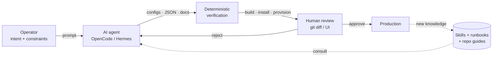
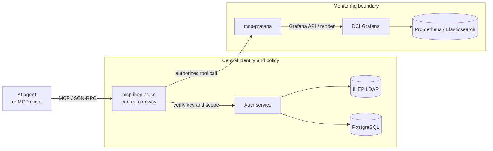
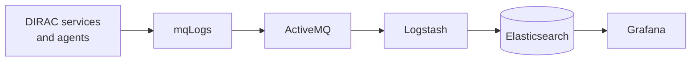
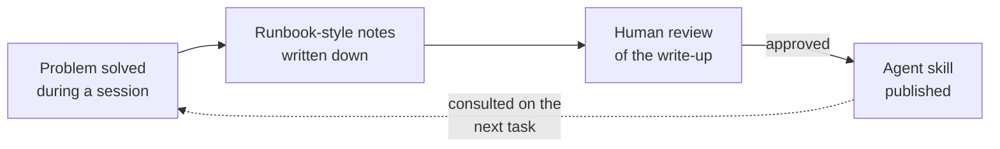

# AI-Assisted DIRAC Deployment<br/>and Operations at IHEP

#### Layered autonomy, review gates, and skills that accumulate

<br>

**Xiao Han** on behalf of the IHEP DCI Group · <a href="mailto:hanx@ihep.ac.cn">hanx@ihep.ac.cn</a>

<br>

**The 12th DIRAC(X) Users' Workshop** · 2026 · *IHEP, Beijing*

<a href="https://dci-grafana.ihep.ac.cn/" class="ns-c-iconlink"><mdi-view-dashboard-outline /> DCI Grafana</a>
 · <a href="https://github.com/hanx-hep/2026-cepc-dci" class="ns-c-iconlink"><mdi-history /> Monitoring report</a>


<!--
Timing: 0:30

Good morning. I am Xiao Han, from the IHEP DCI Group. This talk is about how we use AI agents to help deploy and operate DIRAC at IHEP: the upgrade work toward DIRAC v9, the monitoring stack, controlled agent access, and how operational knowledge is made to stick. One design rule runs through everything: AI proposes and prepares; humans keep the gates.
-->
---
layout: default
---

# What operating DIRAC at IHEP involves

<div class="cols mt-2">
  <div>

<div class="triage-list">
  <div><small>PRODUCTION</small><strong>DIRAC v8.0.58 for JUNO</strong><span>60+ components on 5 servers; 6 SiteDirector instances (JUNO, CEPC, CMS, BES, LHCb, JUNOCloud).</span></div>
  <div><small>IN PREPARATION</small><strong>v9.0.22 migration baseline</strong><span>An isolated test host with a clean v9 install, validated step by step.</span></div>
  <div><small>ON THE HORIZON</small><strong>CEPC computing</strong><span>The monitoring and operations patterns we build now must transfer.</span></div>
</div>

  </div>
  <div>

The daily work is four streams:

- **Deploy** — version upgrades, component installs, config changes
- **Watch** — metrics, availability probes, dashboards
- **Diagnose** — component logs, transfer chains, cross-system traces
- **Record** — runbooks, install notes, the knowledge the next shift needs

<div class="takeaway compact mt-4">
All four are text-and-config heavy — exactly where an AI agent with the right <strong>gates</strong> helps.
</div>

  </div>
</div>


<!--
Timing: 0:50

Context first. In production we run DIRAC v8.0.58 for JUNO: more than sixty components on five servers, and six SiteDirector instances serving different experiments. A v9 migration baseline is being prepared on an isolated test host. And CEPC is coming, so whatever we build must transfer. The daily work falls into four streams: deploy, watch, diagnose, record. All four are text and configuration heavy — which is exactly where AI agents help, if the gates are right.
-->
---
layout: default
---

# Layered autonomy — humans keep the gates

<div class="four-cards mt-4">
  <div class="story-card">
    <h2>L1 · Observes</h2>
    <p>Monitoring illuminates everything. Deterministic checks, dashboards in Grafana.</p>
  </div>
  <div class="story-card">
    <h2>L2 · Advises</h2>
    <p>Agent drafts dashboards, configs, runbooks, docs — always for human review.</p>
  </div>
  <div class="story-card">
    <h2>L3 · Prepares action</h2>
    <p>Agent assembles change + evidence; a human approves each one. Designed, not yet live.</p>
  </div>
  <div class="story-card">
    <h2>L4 · Bounded acts</h2>
    <p>Whitelist of reversible actions with hard caps. Not claimed today — to be earned by data.</p>
  </div>
</div>

<div class="takeaway mt-6">
The axis is <strong>control, not capability</strong>. Every AI output lands in a review gate: a Git diff, a UI check, or an approval click. A weak model means poor wording — never a silent production change.
</div>


<!--
Timing: 1:20

The principle we borrowed from autonomous driving levels, but the axis is control, not capability. Level one: the system observes — deterministic checks and dashboards. Level two: the AI advises — it drafts dashboards, configurations, runbooks, always for human review. Level three, designed but not yet live: the agent prepares an action with its evidence chain, and a human approves. Level four — bounded autonomy over reversible actions — we do not claim today; it has to be earned by data. The one rule that makes this safe: every AI output lands in a review gate. A Git diff, a check in the UI, an approval click. A weak model produces poor wording, never a silent production change.
-->
---
layout: default
---

# The loop: intent → agent → verify → review



<div class="two-notes compact-notes mt-3">
  <div><strong>Agent side</strong><br/>Repetitive work: config surgery, dashboard JSON, install debugging, documentation of what happened.</div>
  <div><strong>Human side</strong><br/>Intent and constraints, the final review of every diff, and the decision to act on production.</div>
</div>


<!--
Timing: 1:05

Here is the loop we actually run. The operator states intent and constraints. An agent — OpenCode or Hermes — picks it up, consulting the accumulated skills, runbooks, and repository guides. It produces configurations, dashboard JSON, or documentation. Verification is deterministic: it installs, it builds, it provisions, or it fails — the LLM never decides success. Then a human reviews the diff and approves or sends it back. What we learn along the way flows back into the skill library. The next slide shows this loop applied to the v9 upgrade.
-->
---
layout: section
---

# 1 · Deploy: the v8 → v9 upgrade prep


<!--
Timing: 0:10

Part one: deployment — the DIRAC v8 to v9 upgrade preparation, done with an agent in the loop.
-->
---
layout: default
---

# A v9.0.22 baseline, built with an agent

<div class="cols mt-2">
  <div>

## What the agent did

- Clean **v9.0.22** install on isolated `diractest` — fresh databases, DIRACOS2 via proxy
- Debugged the pitfalls: proxy hijack, OpenSearch section names, descriptor and MySQL limits, certificate FQDN mismatch
- Stood up **SiteDirectorJUNO**, validated the pilot chain to an HTCondor CE
- Documented every session as runbook-style notes

<div class="takeaway compact mt-1">
Production stays on <strong>v8.0.58</strong> until readiness is proven.
</div>

  </div>
  <div>

## What humans kept

- Version choice and go / no-go — production untouched
- Secrets discipline: tokens and keys <strong>never</strong> enter prompts or docs

<div class="status-stack tight mt-2">
  <div><mdi-check-circle-outline /><span><strong>Pilot chain validated</strong><br/>SiteDirectorJUNO → HTCondor CE → queue → payload</span></div>
  <div><mdi-check-circle-outline /><span><strong>Reusable notes</strong><br/>Each pitfall is a documented step, not tribal memory</span></div>
</div>

  </div>
</div>


<!--
Timing: 1:20

The upgrade case. On the left, what the agent did. A clean v9.0.22 install on an isolated host: DIRACOS2, fresh databases, fresh OpenSearch. It debugged real pitfalls — a proxy hijacking the setup script, OpenSearch section names that differ between install and runtime, file-descriptor limits for runit, MySQL limits, and a host-certificate hostname mismatch that broke the Configuration Server. It stood up SiteDirectorJUNO and walked the full pilot chain to an HTCondor CE. And it wrote everything down in runbook style. On the right, what humans kept: the version decision, the secrets discipline — tokens and keys never enter prompts or documents — and the review of every change. Production stays on v8.0.58. The pilot chain is validated, and every pitfall is now a documented step instead of tribal memory.
-->
---
layout: section
---

# 2 · Operate: monitoring with control


<!--
Timing: 0:10

Part two: operations — monitoring, and controlled agent access to it.
-->
---
layout: default
---

# Dashboards are code the agent can write

<div class="provider-grid mt-3">
  <div class="provider"><strong>10</strong><span>Admin</span></div>
  <div class="provider"><strong>9</strong><span>DIRAC</span></div>
  <div class="provider"><strong>6</strong><span>TPC</span></div>
  <div class="provider"><strong>4</strong><span>User</span></div>
  <div class="provider"><strong>2</strong><span>Shift</span></div>
</div>

<div class="delivery-loop mt-5">
  <div><small>CREATE</small><strong>UI or agent</strong></div>
  <mdi-arrow-right />
  <div><small>CAPTURE</small><strong>Dashboard JSON</strong></div>
  <mdi-arrow-right />
  <div><small>CONTROL</small><strong>Git review</strong></div>
  <mdi-arrow-right />
  <div><small>RECONCILE</small><strong>30 s sync</strong></div>
</div>

<div class="two-notes compact-notes mt-4">
  <div><strong>31 dashboards in Git</strong><br/>Five provisioning providers reconstruct the whole layout from version-controlled JSON, synced every 30 seconds.</div>
  <div><strong>The agent's part</strong><br/>It repeats panels, queries, variables, and layouts across similar dashboards — the SAM v4 view was iterated 18 times through this loop.</div>
</div>


<!--
Timing: 1:05

Monitoring. All thirty-one Grafana dashboards are JSON files in Git, under five providers, synced every thirty seconds. The loop is the same as before: create — by human or agent — capture as JSON, review the Git diff, reconcile automatically. The agent's advantage is repetition: when one dashboard means forty similar panels, it composes them all, and the human reviews one diff. The SAM v4 availability view went through eighteen iterations this way. This is Level two autonomy in daily use: the agent writes, the diff gate decides.
-->
---
layout: default
---

# Agents read Grafana through one gateway



<div class="two-notes compact-notes mt-3">
  <div><strong>Read-first tools</strong><br/><code>search_dashboards</code> · <code>get_dashboard_panel_queries</code> · <code>query_prometheus</code> · <code>get_panel_image</code> — inspection and explanation, behind one authenticated gateway.</div>
  <div><strong>Policy stays centralized</strong><br/>Identity and scope at the gateway; write operations still require explicit authorization.</div>
</div>


<!--
Timing: 1:05

Agents do not touch Grafana directly. Every request goes to the central MCP gateway, which checks the key and its scope against LDAP and PostgreSQL. Only then is the tool call passed to mcp-grafana, which speaks the Grafana API and can render panel images. The tools are read-first: find dashboards, read their queries, run Prometheus queries, return images. This is how the verification step of the loop works in practice — the agent checks the live result of the change it proposed, through a scoped, auditable path.
-->
---
layout: default
---

# Central logs, one search box

<div class="cols mt-2">
  <div>

```text
# /opt/dirac/etc/CAS_Prod.cfg
Logging
{
  DefaultServicesBackends = stdout
  DefaultServicesBackends += mqLogs
  DefaultAgentsBackends = stdout
  DefaultAgentsBackends += mqLogs
}
```



<div class="takeaway compact mt-2">
One backend line turns <strong>60+ components</strong> on 5 servers into one searchable timeline.
</div>

  </div>
  <div>

<div class="dashboard-frame component-dashboard-frame">
  <iframe
    src="https://dci-grafana.ihep.ac.cn/d/bfgu666p30xdsb/component-logs?orgId=1&from=1788912000000&to=1788998400000&timezone=browser&var-Category=$__all&var-Name=$__all&var-Level=$__all&kiosk"
    scrolling="yes"
    class="component-dashboard-iframe"
  ></iframe>
</div>

<div class="text-center mt-2">
  <a href="https://dci-grafana.ihep.ac.cn/d/bfgu666p30xdsb/component-logs?orgId=1&from=1788912000000&to=1788998400000&timezone=browser&var-Category=$__all&var-Name=$__all&var-Level=$__all&kiosk"><mdi-open-in-new /> Open full dashboard</a>
</div>

  </div>
</div>


<!--
Timing: 1:05

Logs. One line in the DIRAC configuration — the mqLogs backend — sends every service and agent's log messages to ActiveMQ, through Logstash, into Elasticsearch. Grafana queries that store. The effect: sixty-plus components on five servers become one searchable timeline. The dashboard on the right is the live Component Logs view, frozen to a past day for this talk. The triage pattern is three steps: distribution — is the error mix abnormal; timeline — when did it change; records — which message is actionable. This is the evidence layer the agent reads through the gateway — and the next slide is what we want to build on top of it.
-->
---
layout: default
---

# Next: logs that raise their hand

<div class="two-notes compact-notes mt-2">
  <div><strong>Delivered</strong><br/>Central collection for 60+ components; distribution, timeline, and record panels; one search box.</div>
  <div><strong>The gap</strong><br/>Logs are searched <em>after</em> a problem is noticed — the archive itself raises no signal.</div>
</div>

<div class="status-stack next tight cols-2 mt-2">
  <div><mdi-arrow-right-circle-outline /><span><strong>Error-pattern detection</strong><br/>Automatic grouping of recurring component errors — Grafana Sift investigations.</span></div>
  <div><mdi-arrow-right-circle-outline /><span><strong>Anomaly alerts on log rates</strong><br/>Alert when warning or error volume deviates from the component baseline.</span></div>
  <div><mdi-arrow-right-circle-outline /><span><strong>Linked metrics ↔ logs</strong><br/>Carry site, component, and time range from a metric spike straight to its logs.</span></div>
  <div><mdi-arrow-right-circle-outline /><span><strong>Agent-assisted triage</strong><br/>The agent reads the same evidence through MCP and drafts the first diagnosis for review.</span></div>
</div>

<div class="takeaway compact mt-3">
The plan must survive the <strong>DIRAC v9 upgrade</strong> — a compatibility requirement, not a re-build.
</div>


<!--
Timing: 0:55

The plan for logs. Today we have collection and search; the gap is that the archive waits for someone to look. Four steps close it: automatic error-pattern grouping with Grafana Sift; alerts on log-rate anomalies; links that carry site, component, and time range from a metric straight into the logs; and agent-assisted triage — the agent reads the same evidence through the MCP gateway and drafts a first diagnosis for human review. One constraint: all of this must survive the v9 upgrade as a compatibility requirement, not a rebuild.
-->
---
layout: section
---

# 3 · Make the knowledge stick


<!--
Timing: 0:10

Part three: the part that compounds — turning fixes into reusable knowledge.
-->
---
layout: default
---

# Every fix becomes a skill



<div class="two-notes compact-notes mt-3">
  <div><strong>In place today</strong><br/>DIRAC and job-operations skills on shared storage; per-repository agent guides (install steps, provisioning rules, command caveats); upgrade notes from the v9 sessions.</div>
  <div><strong>What it changes</strong><br/>The next session starts from the accumulated steps — the proxy pitfall, the section names, the certificate FQDN fix are already written down, waiting to be consulted.</div>
</div>

<div class="takeaway mt-3">
The v9 install pitfalls were solved once and <strong>documented once</strong> — the next host will not rediscover them. Every fix makes the next one easier.
</div>


<!--
Timing: 1:00

This is the loop that makes the work compound. A problem gets solved during a session. The write-up happens in runbook style, and a human reviews it — not for prose, for correctness. Approved notes become agent skills on shared storage, or repository guides that agents read before acting. The upgrade is the proof: the proxy pitfall, the OpenSearch section names, the certificate hostname fix — each was solved once and documented once. The next host install consults those notes instead of rediscovering them. Every fix makes the next one easier.
-->
---
layout: default
---

# Five rules that keep it safe

<div class="rule-list mt-3">
  <div><mdi-check-circle-outline /><span><strong>Detection stays deterministic.</strong> Provisioning sync, Prometheus checks, install success — the LLM never decides whether something works.</span></div>
  <div><mdi-check-circle-outline /><span><strong>Every agent output lands in a review gate.</strong> A Git diff, a UI check, an approval click — nothing reaches production silently.</span></div>
  <div><mdi-check-circle-outline /><span><strong>Access is read-first and scoped.</strong> One authenticated gateway, key and scope checks, write operations need explicit authorization.</span></div>
  <div><mdi-check-circle-outline /><span><strong>Secrets never enter prompts or documents.</strong> Tokens, client secrets, keys, and passwords stay outside — the upgrade notes were written under this rule.</span></div>
  <div><mdi-check-circle-outline /><span><strong>Knowledge is written to be consulted.</strong> Notes and skills are part of the workflow, not an afterthought — they are what the next agent session reads first.</span></div>
</div>


<!--
Timing: 1:05

Five rules hold the whole thing together. Detection stays deterministic — the LLM never decides whether something works. Every agent output lands in a review gate. Access is read-first and scoped through one gateway. Secrets never enter prompts or documents — the upgrade notes were written under exactly this rule. And knowledge is written to be consulted — notes are part of the workflow, not an afterthought. None of these rules required new platforms; they are disciplines applied to ordinary Git repositories, configs, and docs.
-->
---
layout: default
---

# Roadmap: earn autonomy with evidence

<div class="cols mt-2">
  <div>

## Horizontal — widen the loop

<div class="status-stack tight">
  <div><mdi-arrow-right-circle-outline /><span><strong>Log early warning</strong><br/>Error patterns and log-rate anomalies, as planned</span></div>
  <div><mdi-arrow-right-circle-outline /><span><strong>RAG over runbooks</strong><br/>Natural-language query over accumulated notes, on our own infra</span></div>
  <div><mdi-arrow-right-circle-outline /><span><strong>More sources, same contract</strong><br/>HTCondor, storage, transfer logs — checks in, JSON out</span></div>
</div>

  </div>
  <div>

## Vertical — earn L3, then L4

<div class="status-stack next tight">
  <div><mdi-arrow-right-circle-outline /><span><strong>L3 approval cards</strong><br/>Proposed action + evidence chain + one-tap approve; audit table first</span></div>
  <div><mdi-arrow-right-circle-outline /><span><strong>L4 bounded envelope</strong><br/>Reversible actions only, with caps and auto-rollback</span></div>
  <div><mdi-arrow-right-circle-outline /><span><strong>The gate is data</strong><br/>Enough recorded dispositions to prove which actions are safe</span></div>
</div>

  </div>
</div>

<div class="takeaway compact mt-3">
First L3 candidates: <em>retry a failed transfer batch</em> · <em>restart a stuck component</em>. Autonomy is earned by evidence, not by confidence.
</div>


<!--
Timing: 1:00

The roadmap has two directions. Horizontal: widen the loop — log early warning, retrieval over our own runbooks, and more sources under the same contract: checks in, JSON out, memory in the middle. Vertical: earn level three — approval cards that carry the evidence chain, with an audit table built first — and then level four, a small envelope of reversible actions with caps and automatic rollback. The gate between the levels is not engineering effort, it is evidence: the recorded history has to prove an action is safe. Data earns autonomy, not confidence.
-->
---
layout: default
---

# Summary

<div class="three-cards takeaway-cards mt-6">
  <div class="story-card"><strong>1</strong><h2>Gated</h2><p>Layered autonomy with review gates: the agent drafts and verifies, humans decide — in the v9 upgrade and in daily operations alike.</p></div>
  <div class="story-card"><strong>2</strong><h2>Grounded</h2><p>Agents work on real artifacts — dashboard JSON, DIRAC configs, logs — through deterministic checks and one read-first gateway.</p></div>
  <div class="story-card"><strong>3</strong><h2>Compounding</h2><p>Every fix becomes a note, a skill, or a guide. The next session — and the next experiment — starts from all of them.</p></div>
</div>

<div class="closing-line mt-10">
The goal is not an autopilot.<br/>
It is an <strong>operator with a much longer reach</strong>.
</div>


<!--
Timing: 0:50

Three takeaways. Gated: layered autonomy with review gates — the agent drafts, humans decide, from the v9 upgrade to daily dashboards. Grounded: agents work on real artifacts through deterministic checks and one read-first gateway. Compounding: every fix becomes a note, a skill, a guide — the next session and the next experiment start from all of them. The goal is not an autopilot. It is an operator with a much longer reach. Thank you.
-->
---
layout: cover
loop: true
title: Questions
---


# Thank you. Questions?

**Xiao Han · IHEP, CC**<br/>
IHEP DCI Group

<a href="https://dci-grafana.ihep.ac.cn/"><mdi-view-dashboard-outline /> dci-grafana.ihep.ac.cn</a>
 · <a href="https://github.com/hanx-hep/2026-cepc-dci"><mdi-github /> monitoring report</a>

<!--
Timing: 0:15

That is the end of my talk. Thank you — I am happy to take questions.
-->
